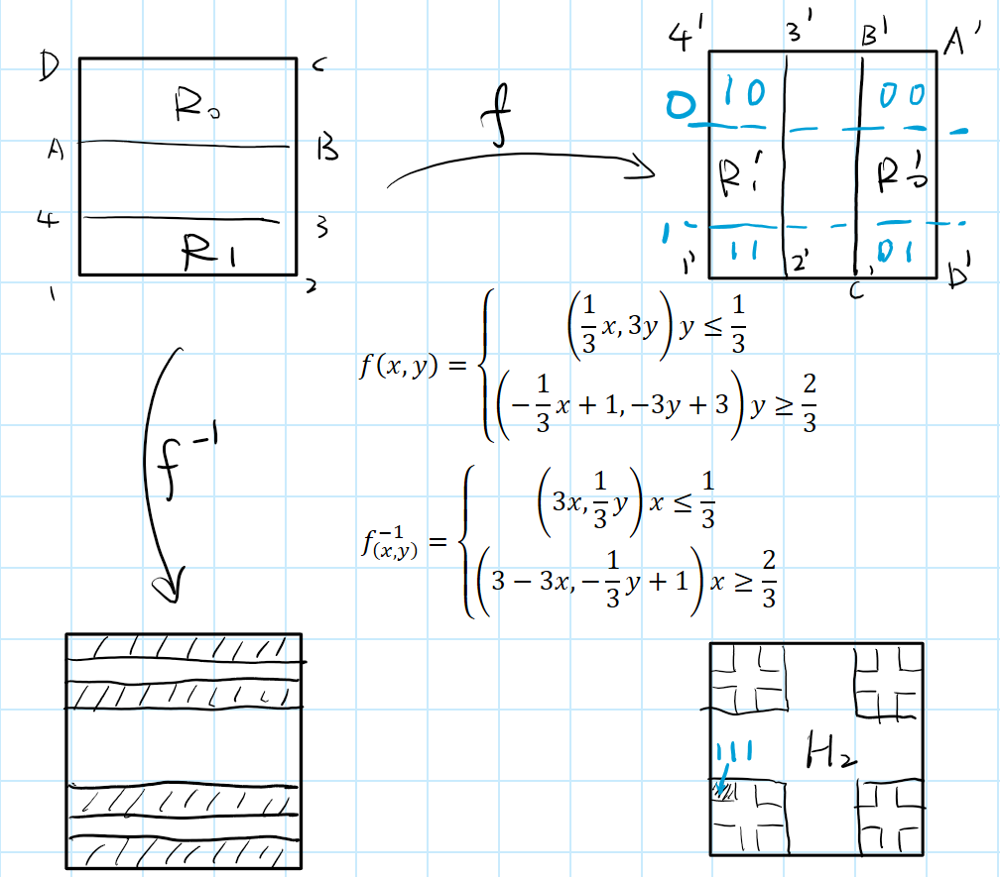

"Dynamical systems study where things go & came from"

## Basic concepts

### Where we study things

$$f:X\rightarrow X,\;X \text{ compact},\; f \text{ continuous}$$
$$x,f(x), f^2(x),\cdots$$ is called the future
$$\cdots, f^{-2}(x), f^{-1}(x), x$$ is the past

Orbit of $$x$$: $$o(x):=\\{f^n(x)\\}_{n\in\mathbb{Z}}$$

### Behavior of Orbits

1.  Limit point: $$f(L)=L$$
2.  Periodic point: $$\exists n \text{ finite}$$ s.t. $$f^n(x)=x$$, n-periodic
3.  Dense orbit: $$\overline{O(x)} = X$$
    i.e. each open set contains a orbit point of $$x$$

e.g. for Circle Rotation $$R_\theta(x)=x+\theta \;(mod\; 1)$$, if $$\theta \in \mathbb{Q}$$, $$R_\theta$$ is periodic; otherwise, $$R_\theta$$ is dense in $$\mathbb{S}^1$$

### Definitions

1.  Transitivity and minimality:
    a)  if a system has a dense orbit, it's called transitive,
    b)  if every orbit in the system is dense, it's called minimal.
2.  North pole & south pole (robust and stable):
    where the system has 2 fixed points, one (south) attracting, one (north) repelling.
3.  saddle node (fragile and unstable):
    $$f^n(x)\rightarrow N$$ on one side, $$f^n(x)\rightarrow S$$ on the other side.

> Note: if a system has N-S poles or saddle point, it's non-dense
{: .prompt-info}

## Smale's horseshoe

$$f:[0,1]\rightarrow[0,1]$$ defined as below, ($$D_{-1}=R_0 \cup R_1$$)

### Encoding (Symbolic Dynamics)
1. Define $$H_n = \cap_{-n}^{n} D_i$$ and $$H=\lim_{n\rightarrow \infty} H_n$$ is the subset irrelevant under $$f$$, looks like a product of *Cantor set*.
2. Starting with $$x\in D_{-1}$$, for each step, $$x$$ is located in one of $$1/3^n$$ square. Encode $$x$$ with $$h(x)_n: H \rightarrow \\{0,1\\}^\mathbb{Z}=\Sigma_2$$ defined as: $$h(x)_n = 0$$ if $$f^n(x)\in R_0$$, $$1$$ otherwise. ($$\cdots,x\rightarrow0,f(x)\rightarrow1,f^2(x)\rightarrow 1,\cdots$$)

> The interior defines x.
{: .prompt-info}

### Decoding

$$g:\Sigma_2\rightarrow H$$
let $$(x_n)_{n\in \mathbb{Z}}\in \\{0,1\\}^\mathbb{Z}$$ be the code,
$$x\in R_{x_0},\;f(x)\in R_{x_1}\rightarrow x\in f^{-1}(R_{x_1}),\;f(x)\in R_{x_2}\rightarrow x\in f^{-1}(R_{x_2}),\cdots$$


$$\implies x=\cap_{n\in \mathbb{Z}}f^{-n}(R_{x_n})$$
 This makes sense since $$R_N(x)=\cap_{-N}^{N}f^{-n}(R_{x_n})$$ has diameter $$\leq 1/3^N$$.

### Some properties of the system

1.  the system has periodic points
2.  the periodic points are dense
3.  the system is transitive
4.  the system is chaotic

## Morphisms

In dynamical systems, we focus on a category of maps called **topological conjugacy** since it preserves desired properties. i.e. **Isomorphisms** in DS.

> **Definition**: if $$\varphi \circ\sigma=f\circ\varphi$$, $$\varphi$$ is a *homeomorphism*, $$\sigma,f$$ are called (topological) **conjugated**.
{: .prompt-info}


$$
\begin{array}{lll}
&X &\xrightarrow{\sigma} &X \\
&\varphi \downarrow&  &\varphi\downarrow \\
&H &\xrightarrow{f} &H
\end{array}
$$

($$X=\Sigma_2,H=H$$ in Smale's Horseshoe)

### Properties
1. $$\varphi$$ takes orbits to orbits
2. periodic orbits to periodic orbits
3. dense orbits to dense orbits
**proof**:
1. wts $$\varphi \circ \sigma^n = f^n \circ \varphi$$
$$\varphi \circ \sigma^n = \varphi \circ \sigma \circ\sigma^{n-1}=f\circ \varphi \circ \sigma^{n-2}=\cdots=f^n \circ \varphi$$
2. let $$p$$ be $$\sigma$$-periodic, $$\sigma^N(p)=p$$, wts $$\varphi(p)$$ is $$f$$-periodic of $$N$$
$$f^N\circ \varphi(p)=\varphi\circ\sigma^N(p)=\varphi(p)$$
3. dense: $$\overline{O_{\sigma}(x)} = X$$, wts $$\overline{O_{f}(h(x))} = H$$
take $$\varnothing\neq V\subsetneq H$$ be a non-trivial open set in $$H$$, the $$h^{-1}(V)$$ is open in $$X$$
$$\implies \exists N \in \mathbb{N}$$ s.t. $$\sigma^N(x) \in \varphi^{-1}(V)$$ (since $$h^{-1}(V) \cap \overline{O_{\sigma}(x)} \neq \varnothing$$)
$$\implies\varphi \circ \sigma^N(x) \in V$$
$$\implies f^N \circ \varphi(x) \in V$$
$${O_{f}(h(x))} \cap V \neq \varnothing$$ for any $$V$$ open, implies $$\overline{O_{f}(h(x))} = H$$

## Symbolic Dynamics

The idea is to encode the system with a symbolic system through topological conjugacy, which is easier to analyze.

### Space $$\Sigma_2=\\{0,1\\}^\mathbb{Z}$$

#### A Metric of $$\Sigma_2$$

$$x,y \in \Sigma_2$$
$$d(x,y)=2^{-j}$$ where $$j$$ is the first index where $$x_j\neq y_j: j=min\\{|k|:x_k\neq y_k,k\in \mathbb{Z}\\}$$

- $$B(1,1/2^3)=\\{x|x_i=1,\forall i<3\\}$$ i.e. $$x_3\neq 1$$ or $$x_{-3}\neq 1$$   $$\cdots,-3,-2,-1,0,1,2,3\cdots$$   $$\cdots,1,1,1,1,1,1,0\cdots$$ $$\cdots,0,1,1,1,1,1,1\cdots$$
- With this metric, $$\Sigma_2$$ is compact.
  **Prop**: the balls $$B(x, 2^{-k})$$ are clopen sets (both open and closed) in $$\Sigma_2$$.   **Col**: $$\Sigma_2$$ is totally disconnected.
  **proof**: **(closed)** let $$(x^{(n)})_{n\in\mathbb{Z}} \subset B(x,2^{-k})$$ be a convergent sequence s.t. $$x^{(n)}\rightarrow x_*$$, we wts $$x_*\in B(x,2^{-k})$$.
  since $$d(x^{(n)},x_*)\rightarrow 0$$, given $$k, \exists N, \forall n>N, x^{(n)}_i=x_{*i},\forall |i|\leq k-1$$ and $$x^{(n)}_{\pm k}\neq x_{*{\pm k}}$$
  now, $$d(x^{(n)},x_*) \leq d(x^{(n)},x)+d(x^{(n)},x_*) \leq 2^{-k}+\epsilon\leq 2^{-k}$$, implies $$x_*\in B(x,2^{-k})$$.
  **(open)** $$\forall y\in B(x,2^{-k})$$, we wts $$\exists n$$ s.t. $$B(y,2^{-n})\subset B(x,2^{-k})$$.
  but this is obvious since we can choose $$n>k$$.

(To be continued)
